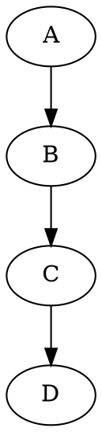
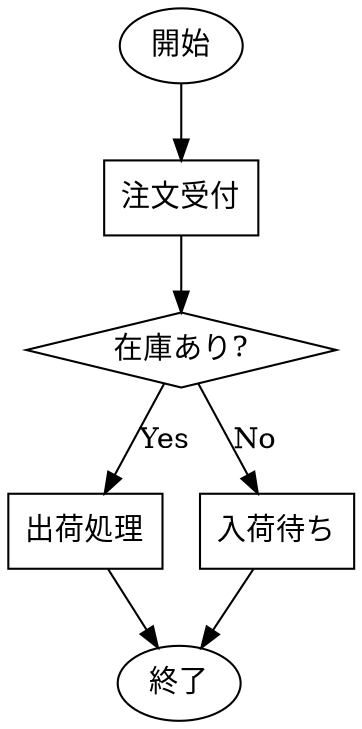
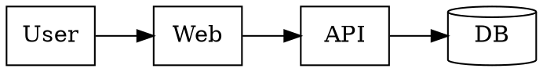
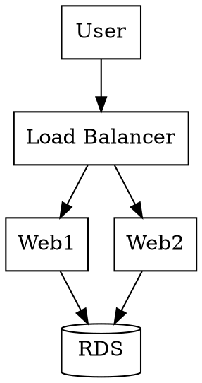
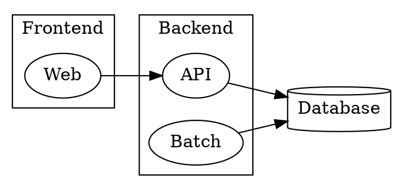
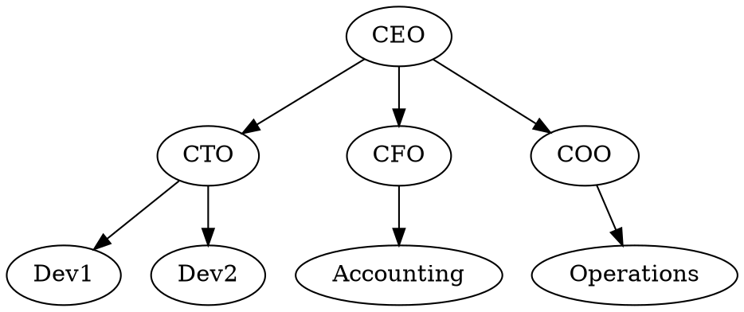
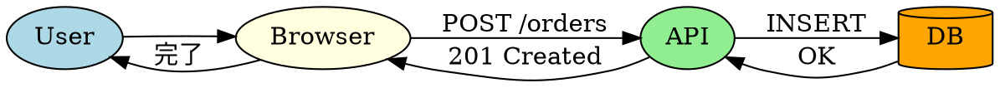

# Graphviz (DOT) Demonstration

---

## 最小サンプル

```dot
digraph G {
    A -> B;
    B -> C;
    C -> D;
}
```

---

## フローチャート

```dot
digraph OrderFlow {

    Start [shape=ellipse, label="開始"];
    Order [shape=box, label="注文受付"];
    Check [shape=diamond, label="在庫あり?"];
    Ship [shape=box, label="出荷処理"];
    Wait [shape=box, label="入荷待ち"];
    End [shape=ellipse, label="終了"];

    Start -> Order;
    Order -> Check;

    Check -> Ship [label="Yes"];
    Check -> Wait [label="No"];

    Ship -> End;
    Wait -> End;
}
```

---

## システム構成図

```dot
digraph System {

    rankdir=LR;

    User [shape=box];
    Web [shape=box];
    API [shape=box];
    DB [shape=cylinder];

    User -> Web;
    Web -> API;
    API -> DB;
}
```

---

## AWS風アーキテクチャ図

```dot
digraph AWS {

    rankdir=TB;

    User [shape=box];

    ALB [label="Load Balancer", shape=box];

    Web1 [shape=box];
    Web2 [shape=box];

    RDS [shape=cylinder];

    User -> ALB;

    ALB -> Web1;
    ALB -> Web2;

    Web1 -> RDS;
    Web2 -> RDS;
}
```

---

## クラスタ（サブグラフ）

```dot
digraph ClusterDemo {

    rankdir=LR;

    subgraph cluster_frontend {
        label="Frontend";
        Web;
    }

    subgraph cluster_backend {
        label="Backend";
        API;
        Batch;
    }

    Database [shape=cylinder];

    Web -> API;
    Batch -> Database;
    API -> Database;
}
```

---

## 組織図

```dot
digraph OrgChart {

    rankdir=TB;

    CEO -> CTO;
    CEO -> CFO;
    CEO -> COO;

    CTO -> Dev1;
    CTO -> Dev2;

    CFO -> Accounting;

    COO -> Operations;
}
```

---

## 総合デモ（おすすめ）

```dot
digraph Demo {

    rankdir=LR;

    node [style=filled];

    User [fillcolor=lightblue];
    Browser [fillcolor=lightyellow];
    API [fillcolor=lightgreen];
    DB [shape=cylinder, fillcolor=orange];

    User -> Browser;
    Browser -> API [label="POST /orders"];
    API -> DB [label="INSERT"];
    DB -> API [label="OK"];
    API -> Browser [label="201 Created"];
    Browser -> User [label="完了"];
}
```

---
